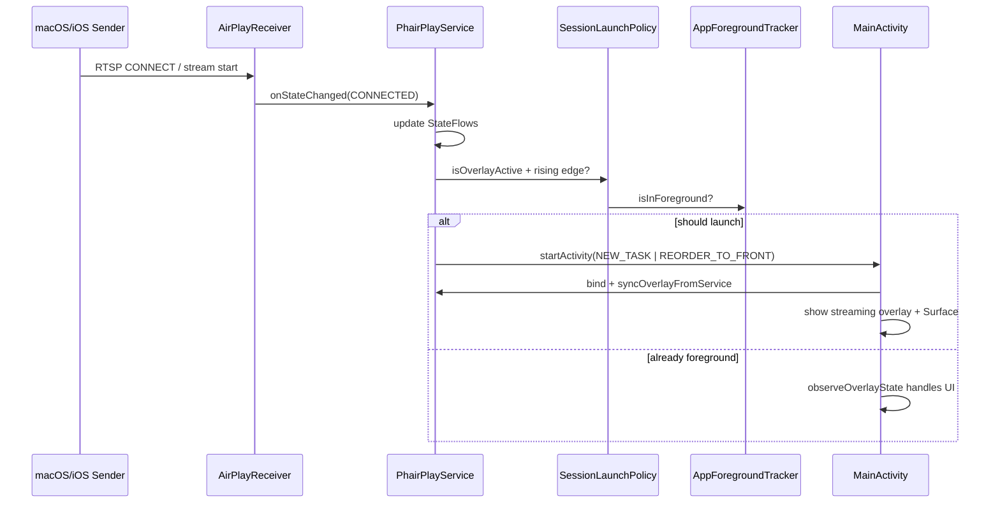

# Auto-Open PhairPlay on AirPlay Session — Design Spec

Version: 1.0  
Status: Approved  
Date: 2026-08-18

---

## Problem

PhairPlay’s AirPlay receiver runs in a foreground service, so the TV keeps advertising and accepting connections even when another app (Netflix, YouTube, etc.) is in front. Video rendering requires `MainActivity`’s `SurfaceView`. Today the user must manually open PhairPlay (notification tap or launcher) to see mirroring, enter a PIN, view now-playing metadata, or display a photo.

## Goal

When any AirPlay session needs a full-screen overlay, automatically bring PhairPlay to the foreground if it is not already visible — even when another app is open.

## Scope

**In scope (v1):**

| Session type | Auto-open? |
|---|---|
| Screen mirroring (`ProtocolState.CONNECTED`) | Yes |
| Audio-only now playing (`nowPlaying != null`) | Yes |
| PIN pairing (`pairingPin != null`) | Yes |
| AirPlay photo (`photoFrame != null`) | Yes |

**Out of scope (v1):**

- Settings toggle to disable auto-open (may be added later).
- Miracast / Cast auto-open (AirPlay only).
- Changing teardown semantics when the user backgrounds PhairPlay during an active stream.

## Non-Goals

- Do not relaunch PhairPlay when the user presses Home during an active session (only on **rising edge** into overlay-active).
- Do not add a second Activity or full-screen-intent notification flow.

---

## Architecture

### Approach

Launch `MainActivity` from `PhairPlayService` when overlay-active state transitions from inactive → active while the app process is in the background.

Reuse the existing overlay predicate in `OverlaySessionPolicy.isOverlayActive()` so launch, keep-screen-on, and BACK-key handling stay aligned.

### Components

| Component | File | Responsibility |
|---|---|---|
| `SessionLaunchPolicy` | `SessionLaunchPolicy.kt` | Pure JVM: rising-edge + foreground gate |
| `AppForegroundTracker` | `AppForegroundTracker.kt` | `ActivityLifecycleCallbacks` — `isInForeground` |
| `SessionLaunchHelper` | `SessionLaunchHelper.kt` | Tracks prior overlay state; calls policy; starts Activity |
| `PhairPlayApp` | `PhairPlayApp.kt` | Installs `AppForegroundTracker` at startup |
| `PhairPlayService` | `PhairPlayService.kt` | Calls helper after overlay-driving StateFlow updates |

### Trigger logic

```
overlayActive = OverlaySessionPolicy.isOverlayActive(state, nowPlaying, photo, pin)
shouldLaunch  = overlayActive && !wasOverlayActive && !isAppInForeground
```

After evaluation, set `wasOverlayActive = overlayActive`.

Rising edge prevents relaunch when the user backgrounds PhairPlay mid-stream. A new session (overlay inactive → active again) triggers launch.

### Launch Intent

```kotlin
Intent(context, MainActivity::class.java).apply {
    addFlags(Intent.FLAG_ACTIVITY_NEW_TASK or Intent.FLAG_ACTIVITY_REORDER_TO_FRONT)
}
context.startActivity(intent)
```

`MainActivity` is already `launchMode="singleTop"` in the manifest.

### Service hook points

Call `refreshOverlaySessionLaunch()` (or equivalent) after updating any overlay-driving signal:

- `onStateChanged` (AirPlay protocol state)
- `onNowPlayingChanged`
- `onPinChanged`
- `onPhotoReceived` / `onPhotoCleared`

Centralizing into one private method on `PhairPlayService` avoids drift across callbacks.

### Foreground detection

`AppForegroundTracker` registers on `Application.onCreate()` via `registerActivityLifecycleCallbacks`. Increment/decrement a started-activity counter; `isInForeground = startedCount > 0`.

No new Gradle dependency (`ProcessLifecycleOwner` not required).

### Error handling

- Wrap `startActivity` in try/catch; log warning on failure (Background Activity Launch restrictions on some OEM/API levels).
- Session continues; notification tap remains fallback.
- No retry loop.

### Android BAL (Background Activity Launch)

PhairPlay runs a visible foreground service (`connectedDevice` type). The user initiates AirPlay on the sender. This combination is the intended TV pattern; real-device validation on Google TV and Fire TV is recommended but not a CI gate per project rules.

---

## Data flow



---

## Testing

### Unit tests (CI gate: `./gradlew :test-runner:test`)

`SessionLaunchPolicyTest` — pure logic:

- Launch on inactive → active overlay when background.
- No launch when already foreground.
- No launch when overlay stays active (user pressed Home mid-stream).
- No launch when idle (`ADVERTISING` only).
- Launch again when overlay goes inactive then active (new session).

### Manual (real TV, optional)

1. Open Netflix on TV; leave PhairPlay running in background (service advertising).
2. Start AirPlay mirroring from Mac → PhairPlay should appear full-screen with video.
3. Repeat for audio-only, PIN pairing, and photo if available.
4. During mirroring, press Home → PhairPlay should **not** immediately relaunch.
5. Stop mirroring, start again → PhairPlay should relaunch from Netflix.

---

## Constraints (from project rules)

- Kotlin 1.9.23, JDK 17; View-based UI; no Compose.
- ≤400 lines per Kotlin file — extract helpers; `PhairPlayService.kt` is already over cap; do not add significant bulk inline.
- KDoc on every new class.
- Unit test for every public method on `SessionLaunchPolicy`.
- CI: `:test-runner:test`, lint both flavors, assemble both flavors.

---

## Future work

- Settings toggle: “Open app when AirPlay starts” (default on).
- Extend to Miracast session start with separate policy if desired.
